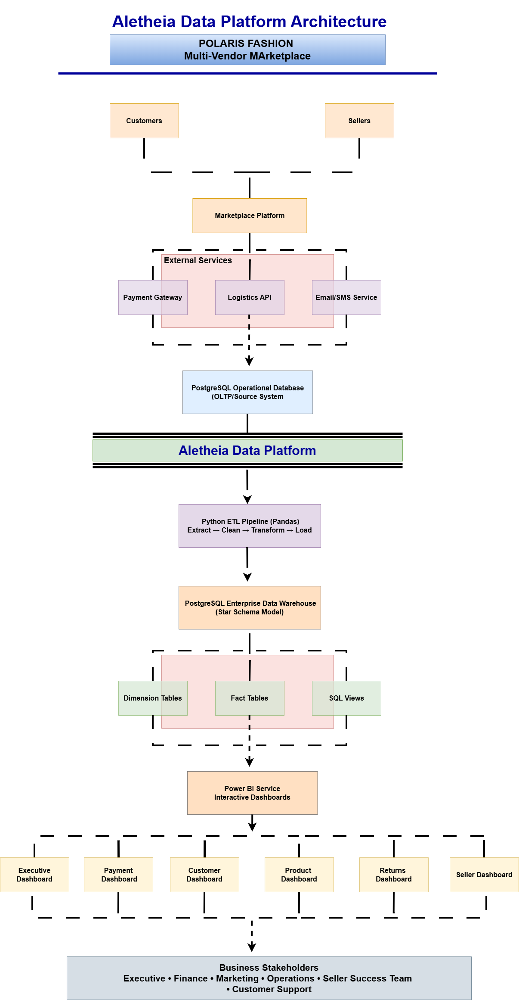
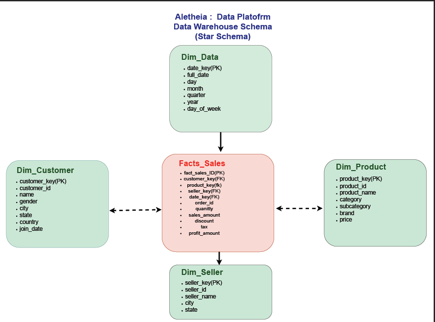
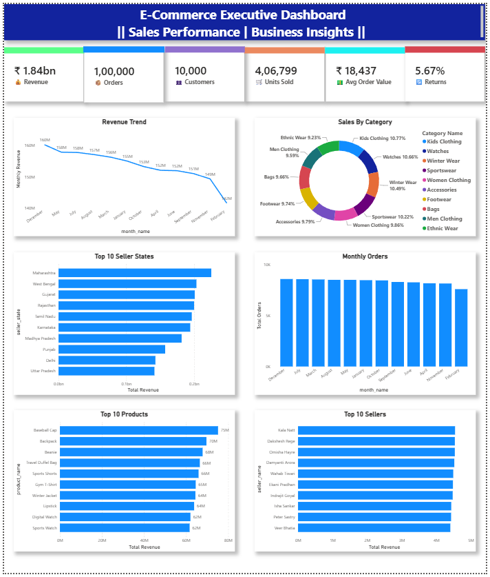
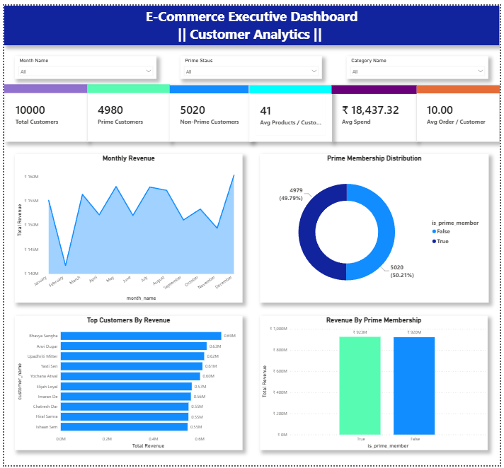
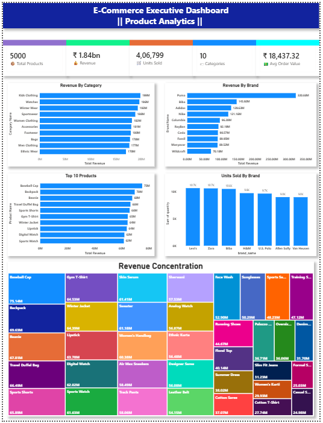
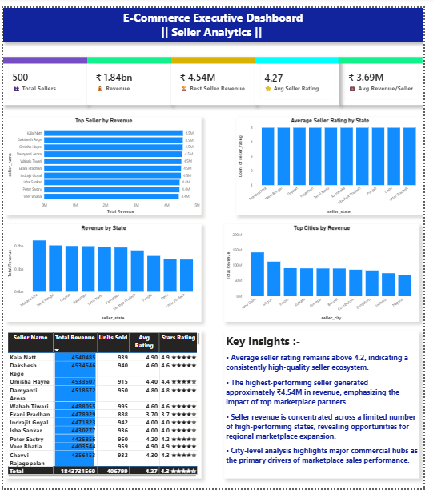
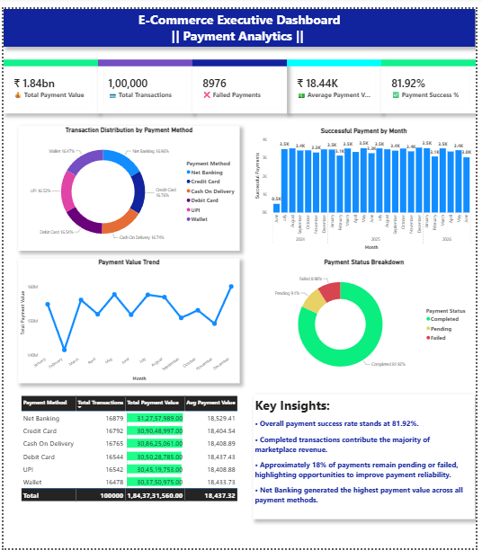
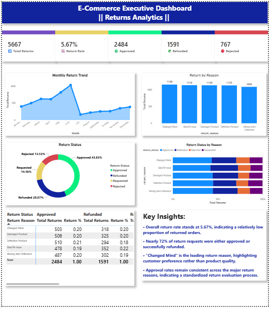

# 🏛️ Aletheia Data Platform

## Enterprise Data Warehouse & Business Intelligence Solution

**Supporting the Polaris Fashion Multi-Vendor Marketplace**

## 🚀 Project Overview

**Aletheia Data Platform** is an end-to-end **Enterprise Data Warehouse & Business Intelligence** solution developed for **Polaris Fashion**, a fictional multi-vendor fashion marketplace.

The platform consolidates raw operational data into a centralized PostgreSQL Data Warehouse using dimensional modeling and provides interactive Power BI dashboards to support executive and operational decision-making.

This project demonstrates the complete analytics lifecycle:

- Data Warehouse Design
- Star Schema Modeling
- ETL Pipeline
- SQL View Layer
- Business Intelligence
- Interactive Dashboards
- Business Documentation

---

# 🎯 Business Problem

Modern e-commerce platforms generate large volumes of transactional data across customers, products, sellers, payments, and returns.

Operational databases are designed for fast transactions—not analytical reporting.

As a result:

- Business reports become slow.
- KPIs are inconsistent.
- Decision-making becomes fragmented.
- Executives lack centralized visibility.

Aletheia solves these challenges by building a dedicated analytical platform optimized for reporting and Business Intelligence.

---

# 🎯 Project Objectives

- Design a scalable PostgreSQL Data Warehouse
- Implement a Star Schema architecture
- Build an ETL pipeline for data transformation
- Create optimized SQL Views for reporting
- Develop executive-ready Power BI dashboards
- Deliver meaningful business KPIs and operational insights

---

# 🏗️ System Architecture

The solution follows a layered enterprise architecture.

```
Raw Operational Data
        │
        ▼
Python ETL Pipeline
(Extract → Transform → Load)
        │
        ▼
PostgreSQL Data Warehouse
        │
        ▼
Business Intelligence Layer
(SQL Views)
        │
        ▼
Power BI Dashboards
        │
        ▼
Business Stakeholders
```

📌 Detailed Architecture Diagram



---

# ⭐ Data Warehouse Design

The warehouse follows a **Star Schema** model.

## Fact Tables

- Fact Sales
- Fact Payments
- Fact Returns

## Dimension Tables

- Dim Customer
- Dim Product
- Dim Seller
- Dim Category
- Dim Date

📌 Star Schema



---

# 🔄 ETL Pipeline

The ETL pipeline consists of three major stages.

### Extract

- Raw CSV datasets
- Operational transactional data

### Transform

- Duplicate removal
- Missing value handling
- Date standardization
- Business rule implementation
- Dimension generation
- Surrogate key mapping

### Load

- PostgreSQL Data Warehouse
- Fact Tables
- Dimension Tables
- SQL Views

---

# 🛠️ Tech Stack

| Layer | Technology |
|--------|------------|
| Programming | Python |
| Database | PostgreSQL |
| ETL | Pandas |
| SQL | PostgreSQL SQL |
| BI Tool | Power BI |
| Documentation | Draw.io, Markdown |
| Version Control | Git & GitHub |

---

# 📊 Dashboard Gallery

---

## 📈 Executive Dashboard

Provides a high-level overview of marketplace performance through KPIs including:

- Total Revenue
- Total Orders
- Average Order Value
- Revenue Trends
- Regional Sales
- Category Contribution



---

## 👥 Customer Analytics Dashboard

Analyzes customer purchasing behaviour.

Features:

- Prime vs Non-Prime Members
- Customer Revenue Contribution
- Geographic Distribution
- Average Customer Spend



---

## 🛍️ Product Analytics Dashboard

Provides detailed product performance analysis.

Features:

- Category Performance
- Brand Performance
- Product Contribution
- Inventory Insights



---

## 🏪 Seller Performance Dashboard

Monitors seller performance across the marketplace.

Features:

- Revenue by Seller
- Order Volume
- Seller Ratings
- Regional Performance



---

## 💳 Payment Analytics Dashboard

Tracks payment operations.

Features:

- Payment Success Rate
- Payment Method Distribution
- Monthly Payment Trends
- Transaction Status



---

## 🔄 Returns Analytics Dashboard

Provides return operation insights.

Features:

- Return Rate
- Return Reasons
- Refund Analysis
- Return Approval Status
- Monthly Return Trends



---

# 💡 Key Business Insights

## Executive

- Generated **₹1.84 Billion** in total revenue.
- Processed **100,000+ customer orders**.
- Maintained an Average Order Value exceeding **₹18,000**.

---

## Customer

- Prime and Non-Prime customers contribute nearly equal revenue.
- Customer purchasing behaviour remains geographically diversified.

---

## Product

- Kid's Clothing generated the highest revenue.
- Puma emerged as the leading performing brand.

---

## Seller

- Revenue distribution remains balanced across sellers.
- Top-performing sellers generated over ₹4.5 Million.

---

## Payments

- Payment Success Rate reached **81.92%**.
- Net Banking generated the highest payment revenue.

---

## Returns

- Overall Return Rate remained below **6%**.
- Return requests are evenly distributed across major return reasons.
- Approval decisions remain consistent across all categories.

---

# 📁 Repository Structure

```text
aletheia-data-platform/

├── architecture/
├── assets/
├── data/
│   ├── raw/
│   ├── processed/
│   └── sample/
├── docs/
├── etl/
├── powerbi/
├── screenshots/
├── sql/
├── README.md
├── LICENSE
└── .gitignore
```

---

# ⚙️ Installation

## Clone Repository

```bash
git clone https://github.com/rudra20-04/aletheia-data-platform.git
```

---

## Configure Environment Variables

Create a `.env` file in the project root.

```env
DB_HOST=localhost
DB_PORT=5432
DB_NAME=ecommerce_dw
DB_USER=your_username
DB_PASSWORD=your_password
```

---

## Execute SQL Scripts

Run in order:

```
01_database_schema.sql

02_dimension_tables.sql

03_fact_tables.sql

04_views.sql

05_indexes.sql

06_business_queries.sql
```

---

## Run ETL Pipeline

```bash
python pipeline.py
```

---

## Open Power BI

Open

```
Ecommerce_Data_Warehouse.pbix
```

Refresh the PostgreSQL connection.

---

# 📚 Documentation

The project includes:

- Business Requirements Document (BRD)
- System Context Diagram
- Data Flow Diagram (DFD)
- Enterprise Architecture Diagram
- Star Schema Design
- SQL Scripts
- Power BI Dashboards

---

# 🚀 Future Enhancements

- Incremental ETL Loading
- Real-Time Data Streaming
- Cloud Deployment (Azure / AWS)
- Machine Learning Integration
- Automated ETL Scheduling
- Data Quality Validation Framework

---

# 💼 Skills Demonstrated

- Data Warehousing
- Star Schema Design
- PostgreSQL
- SQL Development
- ETL Pipeline Design
- Data Transformation
- Business Intelligence
- Power BI
- KPI Development
- Dashboard Design
- Data Visualization
- Git & GitHub

---

# 👨‍💻 Author

## Rudra Mahendrabhai Patel

Computer Engineering Student

**Areas of Interest**

- Data Engineering
- Business Intelligence
- Data Analytics
- Backend Development

**GitHub**

https://github.com/rudra20-04
